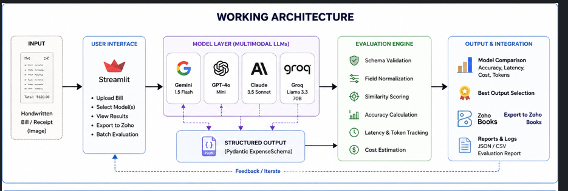
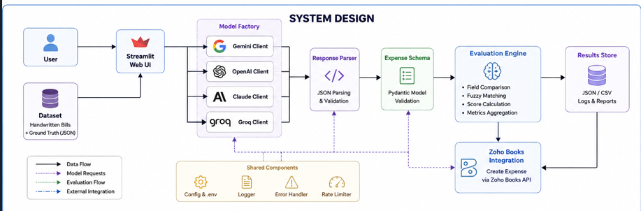
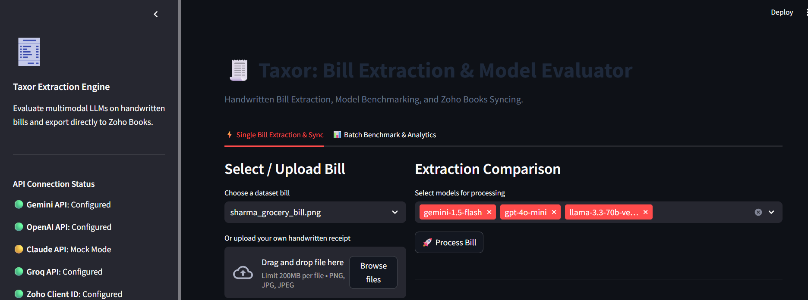

Taxor – AI-Powered Handwritten Bill Extraction & Model Evaluation
📖 Overview

Taxor is an AI-powered handwritten bill extraction framework that evaluates multiple multimodal Large Language Models (LLMs) for extracting structured expense information from handwritten Indian receipts.

The system benchmarks model performance using accuracy, latency, token usage, and API cost while allowing validated expense data to be exported directly into Zoho Books.

Supported Models
Gemini 1.5 Flash
GPT-4o Mini
Claude 3.5 Sonnet
Groq (Llama 3.3 70B) (if you added it)
Features
Handwritten bill extraction
Multi-model benchmarking
Ground-truth accuracy evaluation
Latency & cost analysis
Token usage tracking
Zoho Books integration
Interactive Streamlit dashboard
Batch evaluation framework
Structured JSON validation using Pydantic

## 🏗️ Working Architecture

The system follows a modular pipeline to extract, evaluate, and synchronize expense data from handwritten bills.

### Workflow

1. **Bill Input**
   - The user uploads a handwritten bill or selects a sample bill from the dataset through the Streamlit dashboard.

2. **Model Selection**
   - One or more multimodal LLMs (Gemini 1.5 Flash, GPT-4o Mini, Claude 3.5 Sonnet, and Groq Llama 3.3) are selected for processing.

3. **Expense Extraction**
   - Each selected model independently analyzes the bill image and extracts structured expense information, including:
     - Vendor Name
     - Invoice Number
     - Date
     - Amount
     - Currency
     - Tax Details

4. **Schema Validation**
   - The extracted output is validated using a common **Pydantic ExpenseSchema**, ensuring all models return data in a consistent format.

5. **Evaluation Engine**
   - The structured outputs are compared against the ground truth dataset to calculate:
     - Field-level Accuracy
     - Overall Accuracy
     - Response Latency
     - Token Usage
     - API Cost

6. **Comparison Dashboard**
   - The Streamlit interface displays the extracted results from all selected models, allowing users to compare their performance side by side.

7. **Zoho Books Integration**
   - After reviewing the results, users can choose the best extraction and export the expense directly to **Zoho Books** using its REST API.

### Working Architecture Diagram

## 🏗️ Working Architecture

  

The modular architecture enables independent evaluation of multiple AI models while maintaining a common validation and benchmarking pipeline. This design makes it easy to integrate additional LLM providers, improve evaluation strategies, and extend the system with new downstream integrations.

## 🏛️ System Design

The system is designed using a modular architecture where each component has a single responsibility. This approach improves maintainability, scalability, and makes it easy to integrate additional LLM providers or external services in the future.

### Components

1. **Streamlit Web UI**
   - Provides an interactive interface for users to upload handwritten bills, select AI models, compare extraction results, run batch evaluations, and export expenses to Zoho Books.

2. **Dataset & Ground Truth**
   - Stores handwritten bill images and their corresponding ground truth annotations used for benchmarking model performance and calculating accuracy metrics.

3. **Model Factory**
   - Acts as a centralized layer that dynamically initializes the selected LLM client based on the user's choice. Currently supported models include:
     - Gemini 1.5 Flash
     - GPT-4o Mini
     - Claude 3.5 Sonnet
     - Groq Llama 3.3

4. **Response Parser**
   - Converts model responses into a standardized JSON format and handles response parsing before validation.

5. **Expense Schema Validation**
   - Uses a common **Pydantic ExpenseSchema** to validate and normalize extracted expense fields, ensuring consistent output regardless of the underlying AI model.

6. **Evaluation Engine**
   - Compares extracted values with the ground truth dataset and computes:
     - Field-level Accuracy
     - Overall Accuracy
     - Response Latency
     - Token Usage
     - API Cost
     - Performance Metrics

7. **Results Store**
   - Stores evaluation results, reports, logs, and generated CSV/JSON files for further analysis and benchmarking.

8. **Zoho Books Integration**
   - Enables seamless synchronization of validated expense data with Zoho Books through its REST API, allowing extracted bills to be converted into expense records.

9. **Shared Components**
   - Common utilities such as environment configuration, logging, exception handling, API wrappers, and rate limiting are shared across all modules to ensure consistency and simplify maintenance.

### System Design Diagram

<

  

The modular design separates the user interface, AI model layer, evaluation framework, and external integrations into independent components. This separation allows new LLM providers, evaluation metrics, or downstream services to be integrated with minimal changes to the existing codebase while maintaining a clean and scalable architecture.

## 🔄 Project Workflow

1. User uploads a handwritten bill or selects a sample bill.
2. The selected bill is sent to one or more AI models.
3. Each model extracts structured expense information.
4. Outputs are validated using a common Expense Schema.
5. The evaluation engine compares results with the ground truth dataset.
6. Accuracy, latency, token usage, and API cost are calculated.
7. Results are displayed in the Streamlit dashboard.
8. The selected output can be synchronized to Zoho Books.

## 🛠️ Tech Stack

| Category | Technology |
|----------|------------|
| Language | Python |
| Frontend | Streamlit |
| AI Models | Gemini, GPT-4o, Claude, Groq |
| Validation | Pydantic |
| APIs | OpenAI, Gemini, Anthropic, Groq, Zoho Books |
| Testing | Pytest |

Project Structure:
taxor-handwritten-bill-extraction
│
├── dataset/
├── evaluator/
├── models/
├── outputs/
├── tests/
├── ui/
├── zoho/
├── main.py
├── requirements.txt
└── README.md

##Screenshots:
## 📊 Dashboard

  

## 🤖 Model Comparison

  

## 📈 Performance Metrics

  

## 🔄 Zoho Books Synchronization

  

## 📚 Zoho Books Page

  

## 🌟 Key Highlights

- Supports **4 Multimodal LLMs**
- Automated benchmarking across multiple models
- Measures **Accuracy, Latency, Token Usage, and API Cost**
- Direct integration with **Zoho Books**
- Interactive **Streamlit Dashboard**
- Extensible architecture for adding new AI models